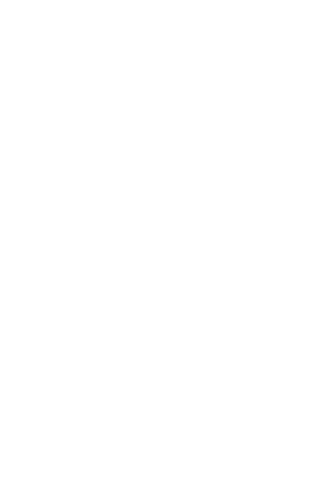
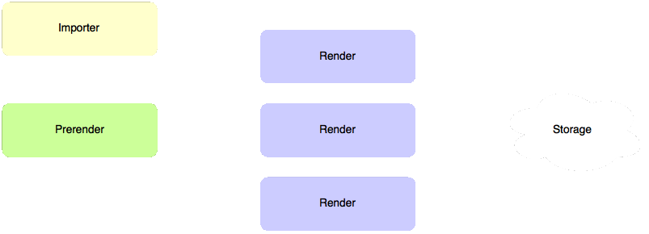

# Gopnik architecture overview

Gopnik consists of 3 daemons and a number of utilities.
Daemons are _dispatcher_, _render_ and _prerenderslave_.
_Dispatcher_ handles requests from users. It checks cache for requested tile and
returns the tile to client or orders _render_ to render it.
_Render_ and _prerenderslave_ maintain pool
of mapnik instances (or other rendering tools). _Render_ and _prerenderslave_ are very
similar, but used differently. _Render_ is used by _dispatcher_ daemon
for dynamic rendering. _Prerenderslave_ used by _prerender_ utility.

Scheme of tile server components:

Request sequence diagram:

Prerendering is a process of filling tile cache by a plan.
See [utils](utils.html) page for details.

