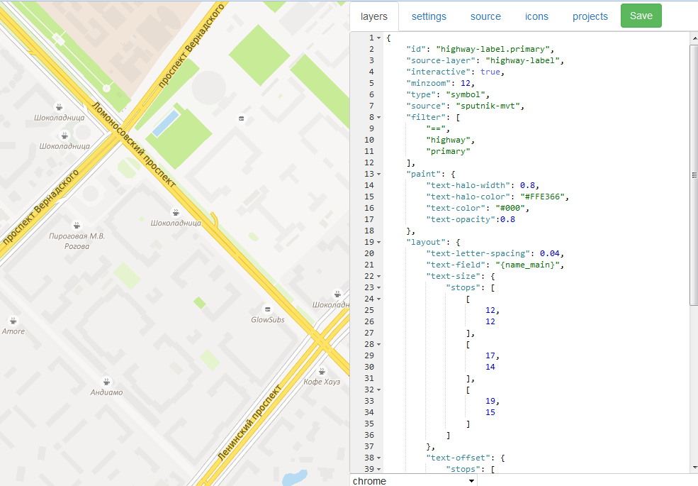

# MVT Styler

MVT Styler is an editor of vector styles for interactive maps. 

Style specification developed by &copy;MapBox: [Mapbox GL Style](https://www.mapbox.com/mapbox-gl-style-spec/)
  
 

## Quick Start

Make sure you have `sqlite3` installed on your system.

Get code at https://github.com/sputnik-maps/mvt-styler

```bash
git clone https://github.com/sputnik-maps/mvt-styler.git
```


## Build project

```bash
./install.sh
```

## Running Application

```bash
./run.sh
```

### For UI-development cycle

```bash
./dev.sh
```

## Uninstalling NPM modules

```bash
./uninstall.sh
```

## Building fonts 

Copy fonts files to ./fonts folder. Then:

```bash
cd fonts
npm install
./build.sh
```

That's it!
